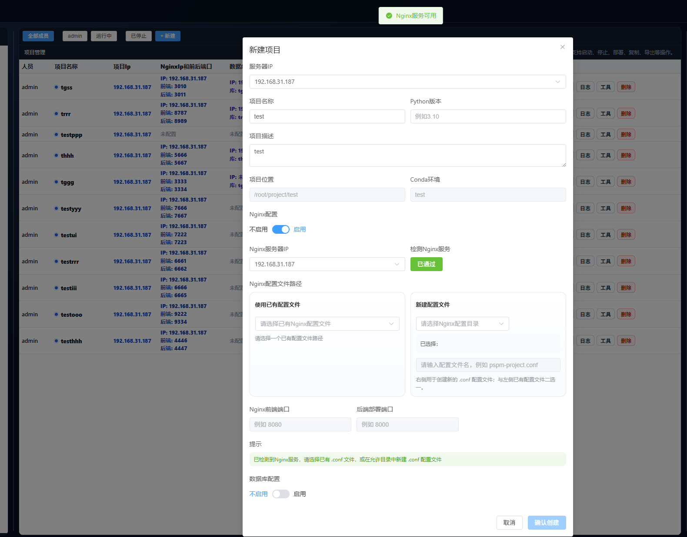
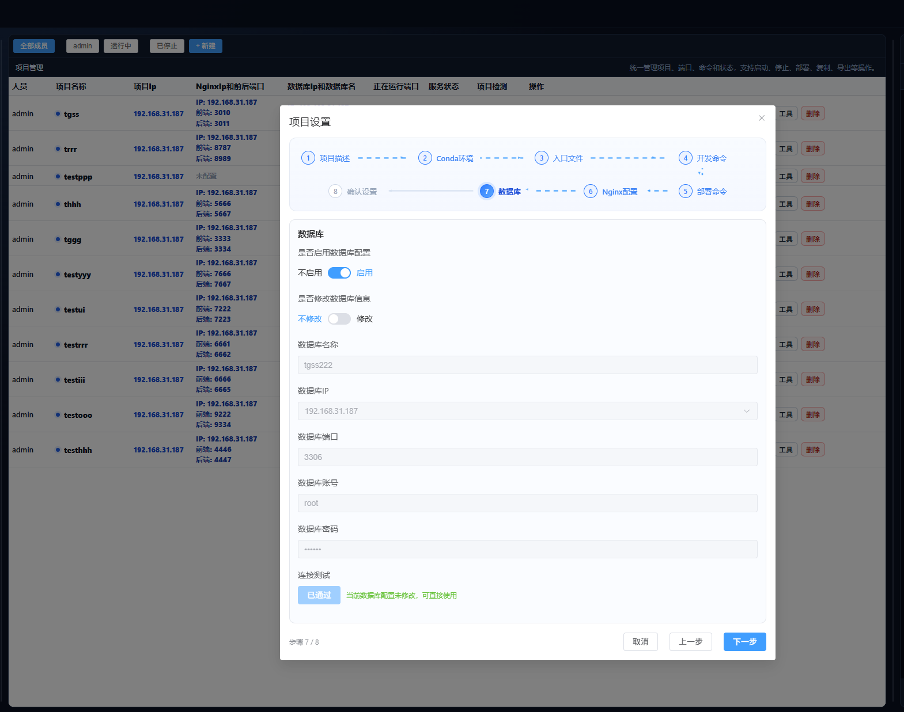
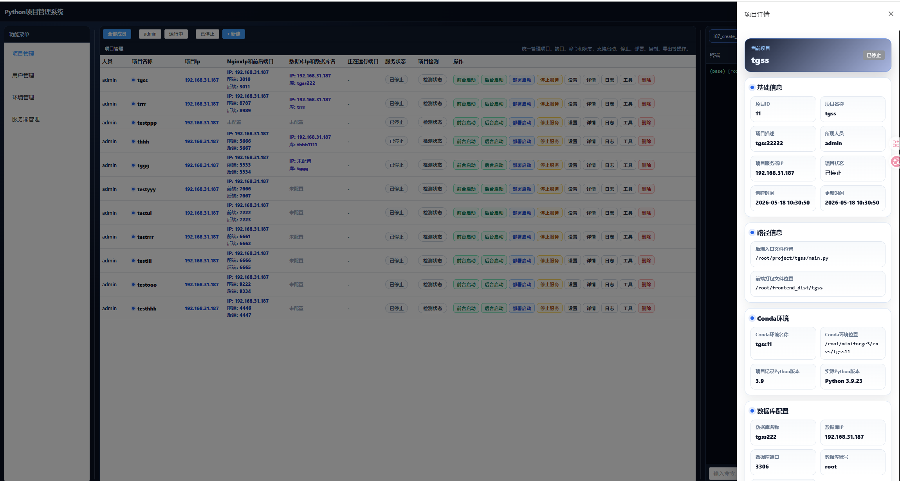
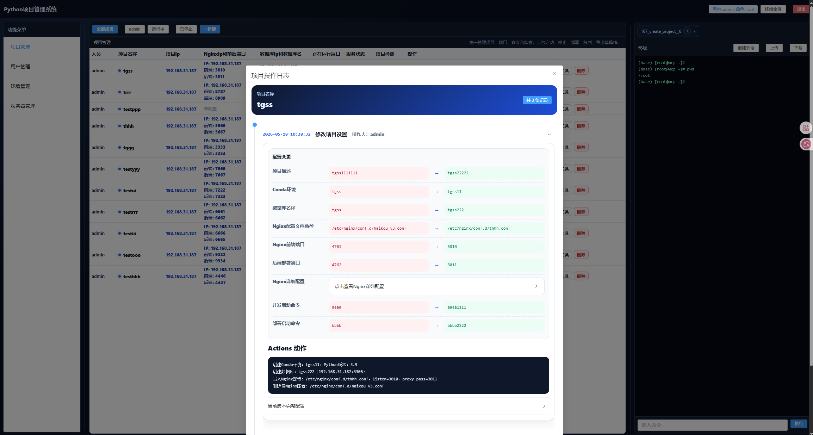

# Python 项目管理系统 · Backend

Python 项目管理系统后端是一个基于 FastAPI 的项目管理与自动化运维 API 服务。它负责用户权限、服务器资源、项目配置、运行控制、状态检测、操作日志和终端会话等后端能力。

系统面向个人 Python 开发者和 Python 团队，适用于集中管理多台服务器上的 Python 项目。它不是简单的项目 CRUD，而是围绕真实服务器操作构建：创建项目目录、创建 Conda 环境、检测 MySQL、写入 Nginx 配置、启动服务、停止服务、记录操作日志。

## 功能截图

### 新建项目流程

后端会根据前端提交的服务器、项目名称、Python 版本、项目路径、Conda 环境、数据库和 Nginx 配置执行实际创建流程。创建动作按整体结果处理，避免只成功一部分造成脏数据。



### 设置工作流

设置接口支持按差异执行实际变更。例如只改数据库就只处理数据库，只改 Nginx 就只处理 Nginx；没有变化的配置不会重复操作。



### 项目详情

详情接口会汇总项目基础信息、项目路径、Conda 环境、Python 版本、数据库、Nginx、启动命令、运行状态等信息，供前端侧边栏展示。



### 操作日志

后端会记录项目创建、设置变更、删除等关键操作，保留当前版本完整配置和执行动作，便于问题回溯。



## 核心能力

- 用户、角色、权限管理：支持 root 和普通用户权限隔离。
- 服务器管理：支持服务器创建、删除、用户分配和可用性验证。
- 项目创建：支持创建项目目录、Conda 环境、数据库和 Nginx 配置。
- 项目同步：支持把服务器上已存在的项目同步纳入平台管理。
- Conda 环境：支持创建、查询、切换、Python 版本检测和按删除范围移除。
- 数据库配置：支持连接检测、数据库存在性判断、数据库创建和删除。
- Nginx 配置：支持检测 Nginx 服务、解析配置文件、写入 server block、删除配置块和重新加载。
- 项目运行：支持前台启动、后台启动、部署启动和停止服务。
- 状态检测：支持服务运行状态、运行端口和项目健康状态检查。
- 操作日志：记录创建、设置、删除等关键操作，保留配置变更上下文。
- 终端能力：支持会话、命令执行、路径补全、命令补全、清屏和输出历史。

## 技术栈

- Python 3.12+
- FastAPI
- SQLAlchemy 2.x
- Pydantic 2.x
- MySQL / aiomysql
- Redis
- Uvicorn
- PyMySQL

## 项目结构

```text
src/
  app/
    api/          API 路由
    core/         配置、数据库、Redis、日志和应用初始化
    crud/         数据访问层
    models/       SQLAlchemy ORM 模型
    schemas/      Pydantic 请求与响应模型
    services/     项目创建、设置、检测、启动、删除、同步等业务服务
    utils/        Shell、Nginx、数据库、路径等工具函数
  commands/       命令行扩展
  artisan.py      初始化、迁移等管理命令
  main.py         应用入口
  requirements.txt
Dockerfile        容器构建文件
bin/              容器启动与 supervisor 配置
```

## 配置

复制示例配置：

```bash
cp .env.example src/.env
```

生成 JWT 密钥：

```bash
cd src
python artisan.py init
```

## 初始化数据库

```bash
cd src
python artisan.py migrate
```

如需重建表结构：

```bash
cd src
python artisan.py migrate --refresh
```

## 启动服务

```bash
cd src
python main.py -host 0.0.0.0 -port 8888
```

API 文档地址：

```text
http://127.0.0.1:8888/api/docs
```

## 前端仓库

```text
https://github.com/Linwangithub/python_project_management_frontend
```

## License

Apache License 2.0
